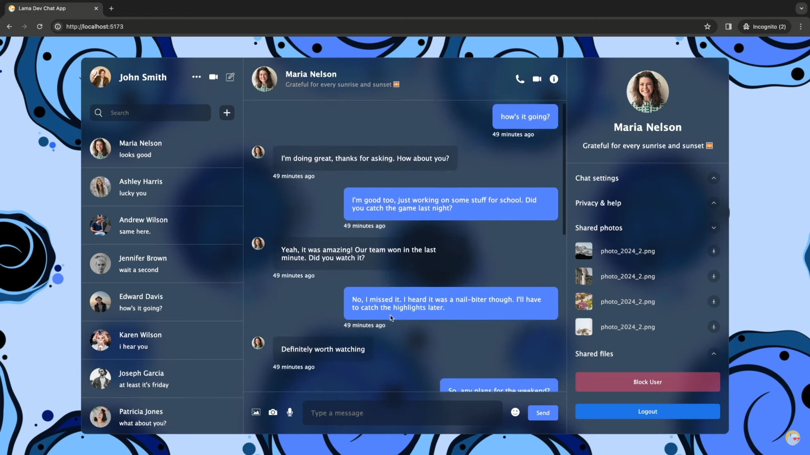
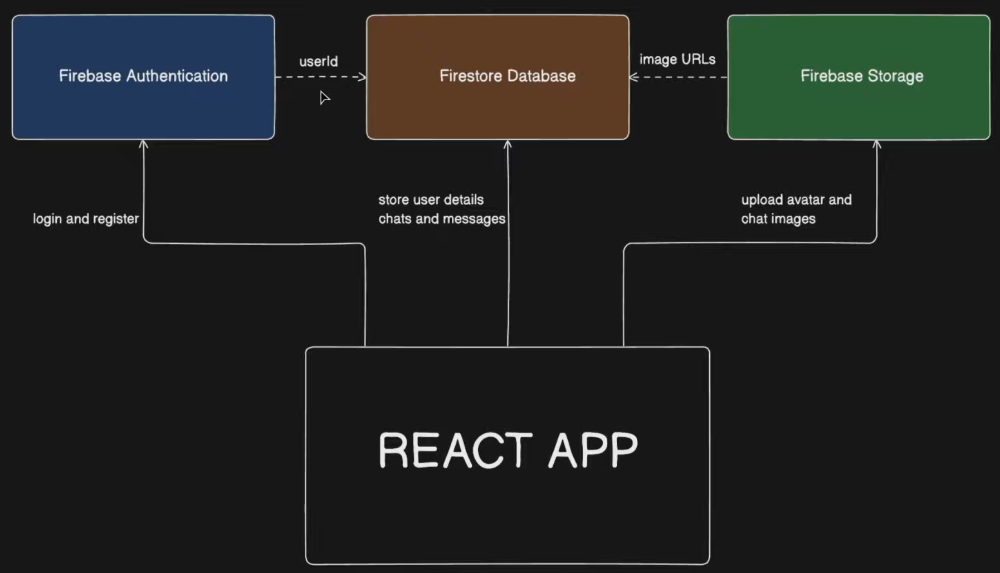
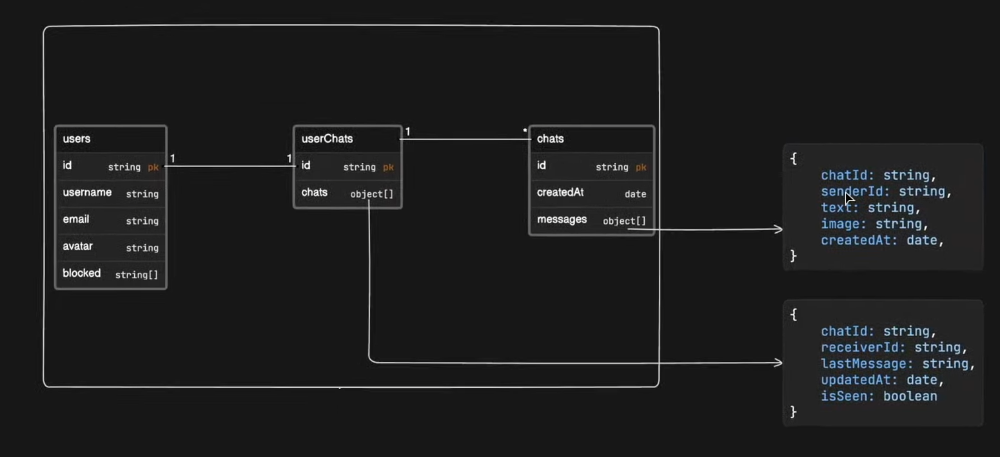

# react-firebase-chat

- Reference 

  [VSCode Snippets For Web Developers](https://github.com/safak/snippets)


- Introduction

  

  > 00:00 Introduction
  >
  > 03:01 Installation
  >
  > 05:28 Chat App Database Structure
  >
  > 10:15 React Chat Application Design Tutorial
  >
  > 12:35 CSS Glass Background Effect 
  >
  > 14:01 Chat App Components
  >
  > 18:15 Chat List Design
  >
  > 22:06 React Search Bar Design
  >
  > 27:23 User List Design
  >
  > 31:07 React Chat Component Design
  >
  > 33:38 React.js How to Add Emoji? (React Emoji Picker)
  >
  > 45:32 Chat Messages Design
  >
  > 50:45 Chat Detail Component Design
  >
  > 01:00:36 React Auto-Scroll using useRef Hook
  >
  > 01:03:50 React Login Page Design
  >
  > 01:14:20 React Notification Library (React Toastify) 
  >
  > 01:17:25 Add New User Component 
  >
  > 01:23:58 React Firebase Tutorial 2024 
  >
  > 01:26:30 React Firebase Authentication Tutorial 
  >
  > 01:31:55 React Firebase Sign Up with Email and Password 
  >
  > 01:33:41 React Firebase How to Add the User Data to Firestore After the Authentication?
  >
  > 01:38:19 React Firebase How to Upload Image?
  >
  > 01:47:12 React Firebase Login (Sign in) with Email and Password
  >
  > 01:49:00 React Firebase How to Store the User After the Authentication?
  >
  > 01:51:30 React Why Do We Need State Management Tools?
  >
  > 01:56:07 React Firebase Auth with Zustand State Management Tool 
  >
  > 02:05:44 React Firebase Fetching Real-time Data 
  >
  > 02:07:30 Fetch User Chats from Firestore
  >
  > 02:14:14 React Search a User from Firebase Firestore
  >
  > 02:18:44 Create a New Chat in React
  >
  > 02:26:22 Fetch a Single Chat and Chat Messages
  >
  > 02:28:00 React Zustand Chat Store
  >
  > 02:38:42 Add a New Chat Message
  >
  > 02:50:44 Add an Image to the Chat Message
  >
  > 02:55:58 How to Block / Unblock User?
  >
  > 03:03:00 React Search Filter Tutorial
  >
  > 03:05:04 How to Deploy a React App to a VPS in 5 Minutes? 
  >
  > 03:14:46 Outro

  


- From

  forked from [safak/react-firebase-chat](https://github.com/safak/react-firebase-chat) 

  ```bash
  git clone ...
  
  npm install  # Installation dependency
  npm run dev  # Run programes
  
  ```

  


## App Structure

- App Structure  [Eraser](https://app.eraser.io/) 

  React Application: ...

  Backend: save our users chats and images ([Google Firebase](https://firebase.google.com/?hl=zh-cn): Authentication, Database, Storage)

  

  


- Database table design

  ```
  users{
    id string pk
    username string
    email string
    avatar string
    blocked string[]
  }
  
  chats{
    id string pk
    createAt date
    messages object[]
  }
  
  userChats{
    id string pk
    chats object[]
  }
  
  users.id - userChats.id
  userChats < chats
  
  ```

  userChats.chats

  ```
  {
    chatId: string
    receuverId: string
    lastMessage: string
    updateAt: date
    isSeen: boolean
  }
  
  ```

  chats.messages

  ```
  {
    chatId: string
    senderId: string
    text: string
    image: string
    createAt: date
  }
  
  ```

  

  


## Page Design

- Page Design

  body, container; left + middle + right 

  left (bar: search for user, our chats)

  middle (component: receive message, send message)

  right (component: user detail, chat detail)

  


- CSS Glass Background Effect  [caniuse](https://caniuse.com/) 

  react-firebase-chat\src\index.css

  ```css
  
  body {
    background-image: url("/bg.jpg");
    display: flex;
    align-items: center;
    justify-content: center;
    height: 100vh;
    color: white;
  }
  
  .container {
    width: 90vw;
    height: 90vh;
    background-color: rgba(17, 25, 40, 0.75);
    backdrop-filter: blur(19px) saturate(180%);
    border-radius: 12px;
    border: 1px solid rgba(255, 255, 255, 0.125);
  }
  
  ```

  


- Chat App Components

  ```bash
  cd src/
  mkdir components && cd components/
  mkdir list chat detail
  
  cd list/ && touch list.css List.jsx
  cd ../chat/ && touch chat.css Chat.jsx
  cd ../detail/ && touch detail.css Detail.jsx
  
  cd ../list/ 
  mkdir userInfo && touch userInfo/UserInfo.jsx userInfo/userInfo.css
  mkdir chatList && touch chatList/chatList.css chatList/ChatList.jsx
  
  ```

  src\App.jsx

  ```jsx
  import Chat from "./components/chat/Chat";
  import Detail from "./components/detail/Detail";
  import List from "./components/list/List";
  
  const App = () => {
    return (
      <div className="container">
        <List />
        <Chat />
        <Detail />
      </div>
    );
  };
  
  export default App;
  
  ```

  src\components\list\List.jsx

  ```jsx
  import "./list.css";
  
  const List = () => {
    return <div className="list">List</div>;
  };
  
  export default List;
  
  ```

  src\components\chat\Chat.jsx

  ```jsx
  import "./chat.css";
  
  const Chat = () => {
    return <div className="chat">Chat</div>;
  };
  
  export default Chat;
  
  ```

  src\components\detail\Detail.jsx

  ```jsx
  import "./detail.css";
  
  const Detail = () => {
    return <div className="detail">Detail</div>;
  };
  
  export default Detail;
  
  ```

  


## Static Page

- Left

  User info: username, avatar, icon

  Search Component: search bat, add new user button

  Chat list: avatar, username, latest message, close (scroll)

- Middle (top + center + bottom)

  User info: username, avatar, icon

  Chat: 

  Send message: 


### Page Left: UserInfo

- src\components\list\userInfo\UserInfo.jsx

  ```jsx
  import "./userInfo.css";
  
  const UserInfo = () => {
    return (
      <div className="userInfo">
        <div className="user">
          
          <h2>Oswin</h2>
        </div>
        <div className="icons">
          
          
          
        </div>
      </div>
    );
  };
  
  export default UserInfo;
  
  ```

  src\components\list\userInfo\userInfo.css

  ```css
  .userInfo {
    padding: 20px;
    display: flex;
    align-items: center;
    justify-content: space-between;
  
    .user {
      display: flex;
      align-items: center;
      gap: 20px;
  
      img {
        width: 50px;
        height: 50px;
        border-radius: 50%;
        object-fit: cover;
      }
    }
  
    .icons {
      display: flex;
      gap: 20px;
  
      img {
        width: 20px;
        height: 20px;
        cursor: pointer;
      }
    }
  }
  
  ```

  


### Page Left: chatList

- src\components\list\chatList\ChatList.jsx

  搜索栏

  聊天列表：滚动条

  ```jsx
  import { useState } from "react";
  import "./chatList.css";
  
  const ChatList = () => {
    const [addMode, setAddMode] = useState(false);
  
    return (
      <div className="chatList">
        {/* component to search */}
        <div className="search">
          {/* Search bar */}
          <div className="searchBar">
            
            <input type="text" placeholder="Search" />
          </div>
  
          {/* Plus button: add new user */}
           setAddMode((prev) => !prev)}
          />
        </div>
  
        {/* component to display list of users */}
        <div className="item">
          
          <div className="texts">
            <span>John Doe</span>
            <p>Hello, let's talk about something.</p>
          </div>
        </div>
  
        <div className="item">
          
          <div className="texts">
            <span>John Doe</span>
            <p>Hello, let's talk about something.</p>
          </div>
        </div>
  
        <div className="item">
          
          <div className="texts">
            <span>John Doe</span>
            <p>Hello, let's talk about something.</p>
          </div>
        </div>
  
        <div className="item">
          
          <div className="texts">
            <span>John Doe</span>
            <p>Hello, let's talk about something.</p>
          </div>
        </div>
  
        <div className="item">
          
          <div className="texts">
            <span>John Doe</span>
            <p>Hello, let's talk about something.</p>
          </div>
        </div>
  
        <div className="item">
          
          <div className="texts">
            <span>John Doe</span>
            <p>Hello, let's talk about something.</p>
          </div>
        </div>
  
        <div className="item">
          
          <div className="texts">
            <span>John Doe</span>
            <p>Hello, let's talk about something.</p>
          </div>
        </div>
  
        <div className="item">
          
          <div className="texts">
            <span>John Doe</span>
            <p>Hello, let's talk about something.</p>
          </div>
        </div>
  
        <div className="item">
          
          <div className="texts">
            <span>John Doe</span>
            <p>Hello, let's talk about something.</p>
          </div>
        </div>
  
        <div className="item">
          
          <div className="texts">
            <span>John Doe</span>
            <p>Hello, let's talk about something.</p>
          </div>
        </div>
      </div>
    );
  };
  
  export default ChatList;
  
  ```

  src\components\list\chatList\chatList.css

  ```css
  .chatList {
    flex: 1;
    overflow: scroll;
    scrollbar-width: thin;
    scrollbar-color: transparent transparent;
  
    .search {
      display: flex;
      align-items: center;
      gap: 20px;
      padding: 20px;
  
      .searchBar {
        flex: 1;
        background-color: rgba(17, 25, 40, 0.5);
        display: flex;
        align-items: center;
        gap: 20px;
        border-radius: 10px;
        padding: 10px;
  
        input {
          background-color: transparent;
          border: none;
          outline: none;
          color: white;
          flex: 1;
        }
  
        img {
          width: 20px;
          height: 20px;
        }
      }
  
      .add {
        width: 36px;
        height: 36px;
        background-color: rgba(17, 25, 40, 0.5);
        padding: 10px;
        border-radius: 10px;
        cursor: pointer;
      }
    }
  
    .item {
      display: flex;
      align-items: center;
      gap: 20px;
      padding: 20px;
      cursor: pointer;
      border-bottom: 1px solid #dddddd35;
  
      img {
        width: 50px;
        height: 50px;
        border-radius: 50%;
        object-fit: cover;
      }
  
      .texts {
        display: flex;
        flex-direction: column;
        gap: 10px;
  
        span {
          font-weight: 500;
        }
  
        p {
          font-size: 14px;
          font-weight: 300;
        }
      }
    }
  }
  
  ```

  


### Page Middle: UserInfo


Page Middle: UserInfo


